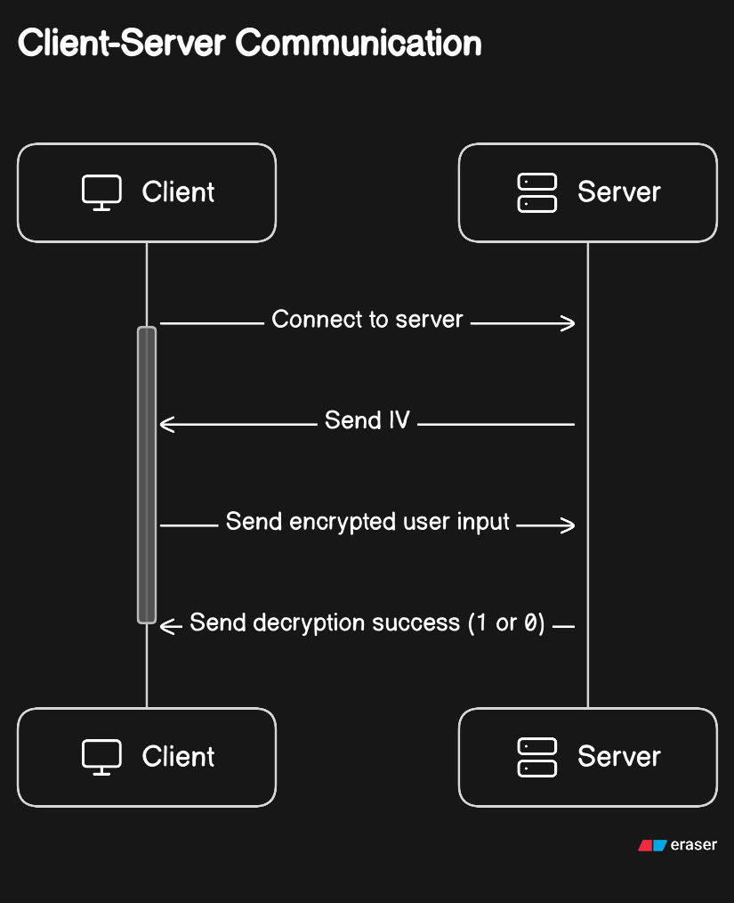
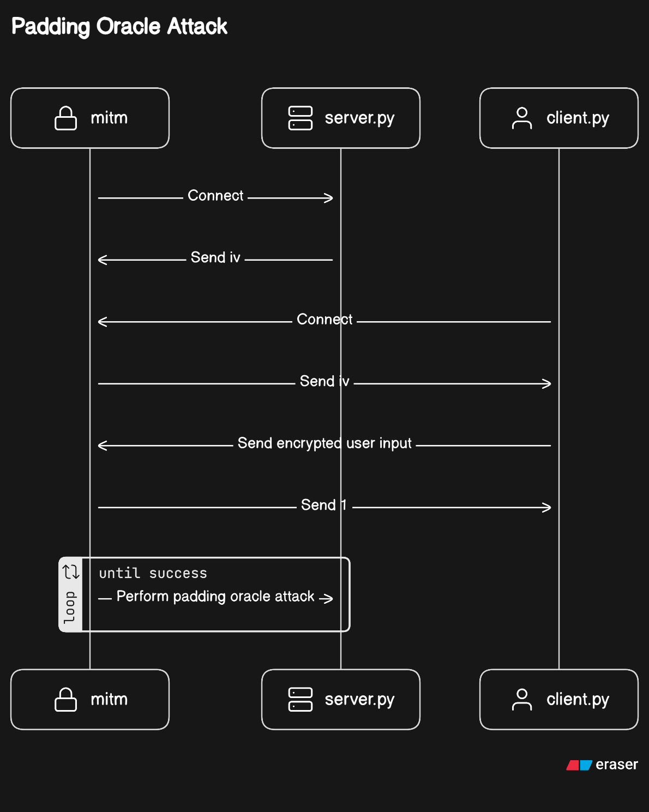

# AES-CBC Padding Oracle Attack Demonstration

 

This project is a comprehensive demonstration of a Padding Oracle Attack on AES in Cipher Block Chaining (CBC) mode. It aims to provide a clear understanding of how vulnerabilities in cryptographic implementations can be exploited.

This project was written by [Jian Wei](https://www.linkedin.com/in/jianwei99/) and [Jun Kai](https://www.linkedin.com/in/yipjk/).

## How the Padding Oracle Attack Works

The Padding Oracle Attack on AES in Cipher Block Chaining (CBC) mode is a cryptographic attack that takes advantage of vulnerabilities in the way data is encrypted and decrypted. Here's a simplified explanation of how this attack works:

1. **AES-CBC Encryption**: In AES-CBC encryption, data is divided into fixed-size blocks, and each block is encrypted using the AES encryption algorithm. The encryption process also involves an Initialization Vector (IV) and an encryption key.

2. **Padding**: To ensure that each block of plaintext is the correct size for encryption (e.g., 128 bits), padding is added to the last block if needed. Common padding schemes include PKCS7.

3. **Attacker's Position**: The attacker intercepts the encrypted ciphertext between the client and the server, with the possibility that the IV may be public, but they lack access to the encryption key.

4. **Padding Oracle**: A padding oracle is a service provided by the server that informs the attacker whether the decrypted plaintext has valid padding. If the padding is valid, the server responds with "success" (e.g., `b'1'`), and if the padding is invalid, the server responds with "failure" (e.g., `b'0'`).

5. **Attack Process**:

   - The attacker starts by modifying the ciphertext and observing the server's responses.
   - By altering the last byte of the ciphertext, the attacker can manipulate the padding byte. They iterate through all possible values (0x01, 0x02, ..., 0xFF) until they find a value that results in valid padding.
   - Once valid padding is found for the last byte, the attacker can determine the value of that byte in the plaintext.

6. **Block Decryption**: The attacker then moves to the previous block, trying to determine the second-to-last byte. This is done iteratively until the entire block is decrypted.

7. **Repeat for All Blocks**: The process is repeated for each block of ciphertext. By chaining these blocks together, the attacker can decrypt the entire message and recovers the plaintext message without having the encryption key.

## Simulation Parameters

In this simulation, we define the following key parameters and conditions to facilitate the simulation of the attack:

1. **Encryption key**: The encryption key is fixed on both server and client. A random 16-byte was chosen.

2. **Initialization Vector (IV) Generation**: The server generates the Initialization Vector (IV) randomly for each encryption session and passes it over to the client / MITM during the initial connection.

3. **Padding Scheme**: We assume the use of PKCS7 padding in this simulation. It is used for simplicity in this project.

4. **Client-Proxy Interaction**: We assume that the client connects directly to the man-in-the-middle (MITM) proxy server.

5. **Hash**: A (16 byte) MD5 hash of the plain text is appended to the plain text before encryption.

This attack can be applied to any CBC-based encryption process, and it can target any padding format used; AES-CBC and PKCS7 was chosen for this demonstration.

Please note that these parameters do not represent secure or recommended practices for real-world applications and are strictly for educational purposes.

## System Illustrations

| Normal Client-Server Interaction                                                    | Intercepted interaction                                                    |
| ----------------------------------------------------------------------------------- | -------------------------------------------------------------------------- |
|                            |                              |
| The diagram above illustrates the normal interaction between the client and server. | The second diagram demonstrates the Padding Oracle Attack in this project. |

## Project Structure

This project consists of several files, each with a specific purpose:

| File Name   | Description                                                                                                                                                                                                                               |
| ----------- | ----------------------------------------------------------------------------------------------------------------------------------------------------------------------------------------------------------------------------------------- |
| `server.py` | Runs a socket server that listens for incoming encrypted ciphertext. On the first connection, it sends an IV to the client. It attempts to decrypt the received ciphertext and responds with either `b'1'` (success) or `b'0'` (failure). |
| `client.py` | Connects to the server / proxy and waits for user input (data). On first connect, it awaits an IV. It then encrypts the data and sends it to the server.                                                                                  |
| `mitm.py`   | Acts like the server, then performs a padding oracle attack on it.                                                                                                                                                                        |

## Installation

This project uses [Poetry](https://python-poetry.org/) for dependency management. To install the project dependencies, navigate to the project directory and run the following command:

```bash
poetry install
```

## Usage

To use this project, you need to run the server, client, and MITM scripts with the appropriate arguments:

- Run the server script with the desired port number:

  ```bash
  python server.py <port>
  ```

- Run the client script with the server address and server port number:

  ```bash
  python client.py <server address> <server port>
  ```

- Run the MITM script with the server address, server port, and proxy port:

  ```bash
  python mitm.py <server address> <server port> <proxy port>
  ```

## Acknowledgment

### Diagrams Generated with DiagramGPT

The diagrams featured in this README were created using [DiagramGPT](https://eraser.io) by [eraser.io](https://eraser.io). These visuals are designed to facilitate the understanding of complex concepts. Please be aware that they are intended for educational purposes.
