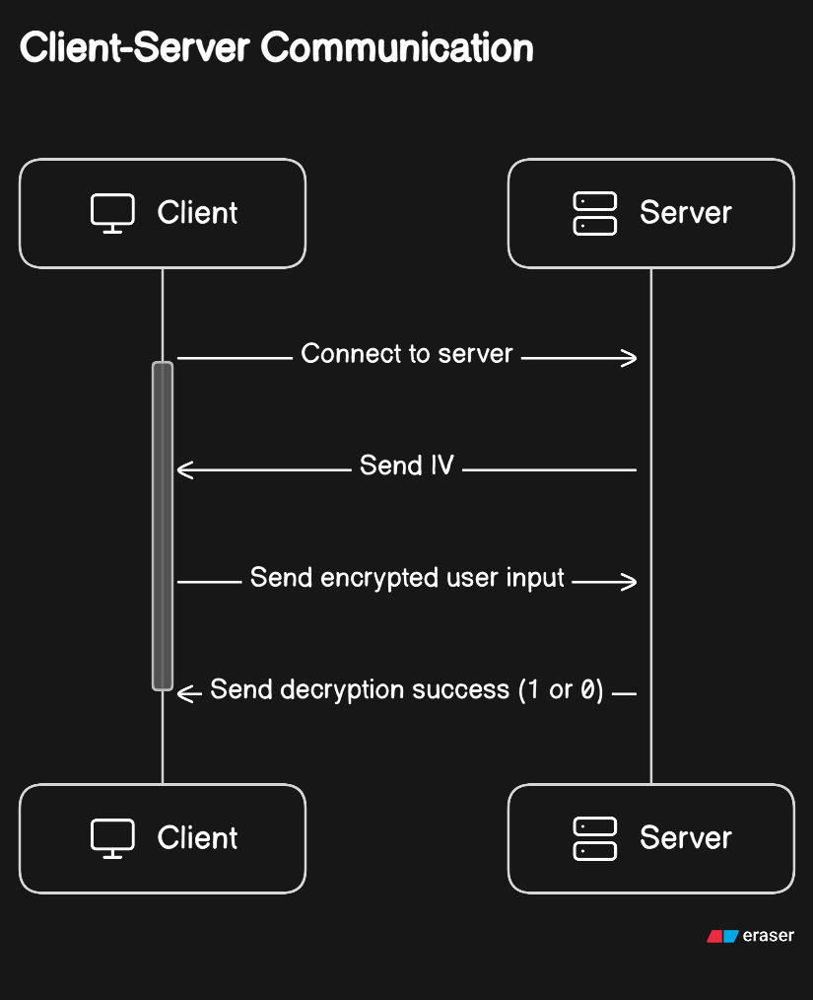
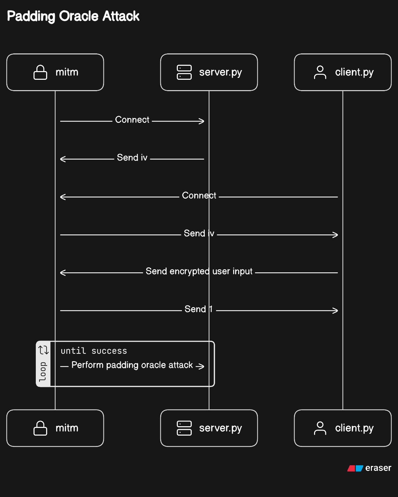

# AES-CBC Padding Oracle Attack Demonstration

 

This project is a comprehensive demonstration of a Padding Oracle Attack on AES in Cipher Block Chaining (CBC) mode. It aims to provide a clear understanding of how vulnerabilities in cryptographic implementations can be exploited.

In this simulation:

- The sever generates the IV, and passes it over during initial connection.
- The client connects directly to the man-in-the-middle proxy server (MITM).

This project was written by [Jian Wei](https://www.linkedin.com/in/jianwei99/) and [Jun Kai](https://www.linkedin.com/in/yipjk/).

## Project Structure

This project consists of several files, each with a specific purpose:

- `server.py`: This file runs a socket server that listens for incoming encrypted ciphertext. It attempts to decrypt the received ciphertext and responds with either b'1 (success) or b'0 (failure).
- `client.py`: This file connects to the server and waits for user input (data). It then encrypts the data and sends it to the server.
- `mitm.py`: This file waits for encrypted ciphertext, then performs a padding oracle attack on it.

## System Illustrations

### Normal Client-Server Interaction



The diagram above illustrates the normal interaction between the client and server.

### Padding Oracle Attack



The second diagram demonstrates the Padding Oracle Attack in this project.

## Installation

This project uses [Poetry](https://python-poetry.org/) for dependency management. To install the project dependencies, navigate to the project directory and run the following command:

```bash
poetry install
```

## Usage

To use this project, you need to run the server, client, and MITM scripts with the appropriate arguments:

- Run the server script with the desired port number:

  ```bash
  python server.py <port>
  ```

- Run the client script with the server address and server port number:

  ```bash
  python client.py <server address> <server port>
  ```

- Run the MITM script with the server address, server port, and proxy port:

  ```bash
  python mitm.py <server address> <server port> <proxy port>
  ```

## Acknowledgment

### Diagrams Generated with DiagramGPT

The diagrams featured in this README were created using [DiagramGPT](https://eraser.io) by [eraser.io](https://eraser.io). These visuals are designed to facilitate the understanding of complex concepts. Please be aware that they are intended for educational purposes.
